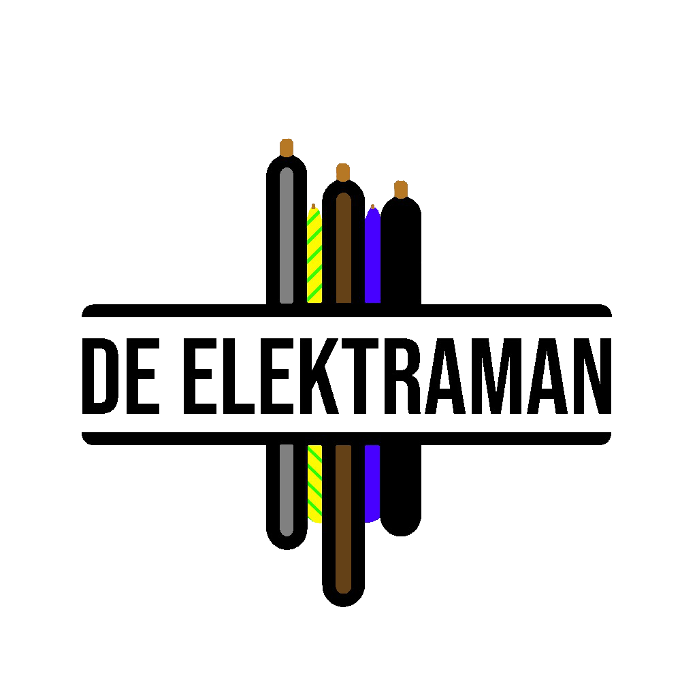

# De Elektraman



**De Elektraman** is a modern website built with **Vue 3** and **Vite** to showcase the services and expertise of an electrical company. It includes a professional layout, contact form, project gallery, and service pages, designed to attract and engage clients. The site is hosted on **Strato** and optimized for performance, scalability, and user experience.

---

## Table of Contents

- [Project Description](#project-description)
- [Folder Structure](#folder-structure)
- [Recommended IDE Setup](#recommended-ide-setup)
- [Type Support for `.vue` Imports in TS](#type-support-for-vue-imports-in-ts)
- [Customize Configuration](#customize-configuration)
- [Project Setup](#project-setup)
- [Credits](#credits)
- [Scripts](#scripts)

---

## Folder Structure

Here’s a detailed look at the project structure:

```plaintext
├── README.md
├── composer.json
├── composer.lock
├── env.d.ts
├── eslint.config.js
├── index.html
├── package-lock.json
├── package.json
├── public
│   └── favicon.ico
├── src
│   ├── App.vue
│   ├── assets
│   │   ├── logo.png
│   │   ├── main.css
│   │   └── reset.css
│   ├── components
│   │   ├── About.vue
│   │   ├── ContactForm.vue
│   │   ├── FooterSection.vue
│   │   ├── Hero.vue
│   │   ├── NavSection.vue
│   │   ├── Portfolio.vue
│   │   ├── Services.vue
│   │   └── pages
│   │       ├── AboutPage.vue
│   │       ├── ContactPage.vue
│   │       ├── HomePage.vue
│   │       ├── PortfolioPage.vue
│   │       └── ServicesPage.vue
│   ├── main.ts
│   ├── sendEmail.php
│   └── shims-vue.d.ts
├── tsconfig.app.json
├── tsconfig.json
├── tsconfig.node.json
├── vendor
│   ├── autoload.php
│   ├── composer
│   │   ├── ClassLoader.php
│   │   ├── InstalledVersions.php
│   │   ├── LICENSE
│   │   ├── autoload_classmap.php
│   │   ├── autoload_files.php
│   │   ├── autoload_namespaces.php
│   │   ├── autoload_psr4.php
│   │   ├── autoload_real.php
│   │   ├── autoload_static.php
│   │   ├── installed.json
│   │   ├── installed.php
│   │   └── platform_check.php
│   ├── graham-campbell
│   │   └── result-type
│   ├── phpmailer
│   │   └── phpmailer
│   ├── phpoption
│   │   └── phpoption
│   ├── symfony
│   │   ├── polyfill-ctype
│   │   ├── polyfill-mbstring
│   │   └── polyfill-php80
│   └── vlucas
│       └── phpdotenv
└── vite.config.ts
```

---

## Recommended IDE Setup

Use **[VSCode](https://code.visualstudio.com/)** with the **[Volar](https://marketplace.visualstudio.com/items?itemName=Vue.volar)** extension (disable Vetur for compatibility).

---

## Type Support for `.vue` Imports in TS

To handle `.vue` type information, replace the default `tsc` CLI with `vue-tsc`. Ensure your editor uses **Volar** to integrate `.vue` types seamlessly.

---

## Customize Configuration

See the official [Vite Configuration Reference](https://vite.dev/config/).

---

## Project Setup

To get started, follow these steps:

1. Install dependencies:

   ```sh
   npm install
   ```

2. Compile and hot-reload for development:

   ```sh
   npm run dev
   ```

3. Type-check, compile, and minify for production:

   ```sh
   npm run build
   ```

4. Lint the project with **ESLint**:
   ```sh
   npm run lint
   ```

---

## Credits

Special thanks to the Vue.js and Vite communities for excellent resources and tools.

---

## Scripts

- `npm install`: Install project dependencies.
- `npm run dev`: Compile and hot-reload for development.
- `npm run build`: Type-check, compile, and minify for production.
- `npm run lint`: Lint the project with **ESLint**.
